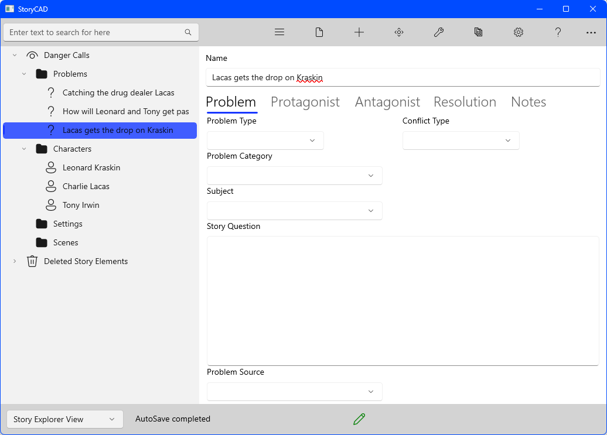
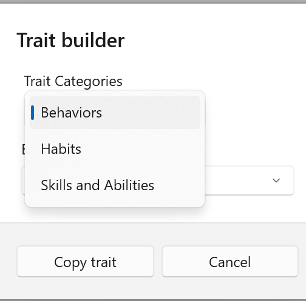
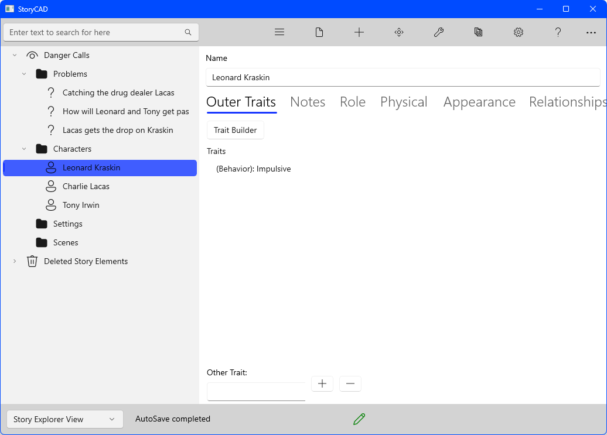
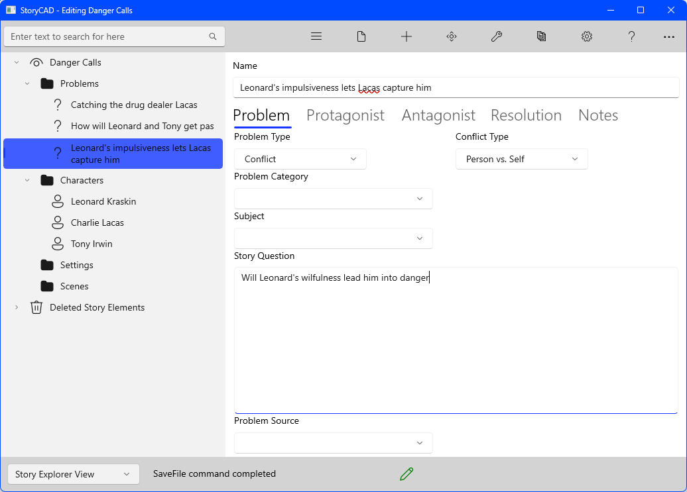

## Creating a Story pt 4
Let’s return to our original problem’s Story Question again:

What if a police detective uses a criminal's phone to gain time to effect a rescue, by calling the dealer at the critical moment?

We’re still working on our premise, and this is the time when defining Problem 
story elements is  critical. What else is there? 

We did throw in the phrase ‘effect a rescue’.  The ‘effect a rescue’ phrase raises the question: rescue from what? We could also ask where this phrase came from and what that phrase is even doing in the Story Question,  but it clearly seems to involve drama and more drama is always good. Your subconscious will often give you what you need, if you let it. Perhaps Lacas ‘gets the drop’ on one or both of our detectives somehow. We can add that as an additional story problem:

Rather than ‘gets the drop on the detectives’, I used one detective, so that the other can affect the rescue. But how did Lacas gain the upper hand? 

If our story idea and concept centered around and started with a character or characters, we would be looking for a story problem that fits those characters, but we started with a situation, and our characters aren’t too well defined. The heart of a story is a character with a problem, however. Maybe it’s time to look at characterization better.

Let's shift gears for a moment and think about outer and inner problems.  The section Defining Problems discusses this topic in some detail.

The outer or external problem we've just added has a physical goal--- to catch Charlie Lacas and send him to jail.  External problems focus attention on physical actions and away from your characters.  To balance the story with a measure of character orientation, we'll add an inner problem for our protagonist to overcome.  Let's give Leonard a character flaw to deal with. 

Click on the Lenard Kraskin node and then click on the Outer Traits tab. The Content Pane contains a button for a tool, Trait Builder, and an empty list of traits. If you click on the Trait Builder tool you’ll see this:

Clicking on Behaviors will give you a list of example behaviors: 

And right there is what we’re looking for. Remember, we have no preconceptions about Leonard's character; he's a blank sheet of paper.  He can therefore easily be molded to suit the story, and giving him a character flaw by making him impulsive is a step in that direction.

Click on Impulsive and Copy Trait to add the trait:

Note that this is an outer rather than an inner trait. Inner traits are aspects of character stemming from psychological and social causes. External traits are habits and behaviors which reflect and illustrate the inner traits. It turns out that Impulsiveness is also a value under the Adventurousness  quality on the Inner Traits tab, so we can select that value as well:

We should remember though, that  to affect the story’s outcome, traits need to be demonstrated as external actions, under the 'show, don't tell' maxim. We need Leonard to exhibit Impulsiveness in an action that puts him in a situation where he needs rescue.

With this change we can now rename our third problem (Lacas gets the drop on Kraskin) to something more precise:

Both the Conflict Type and the Story Question address the flawed character trait.

As a Person vs. Himself problem, the Protagonist and the Antagonist are both Leonard, but before fleshing these out, let’s look at the Resolution. Here’s what I started with:

Leonard Kraskin, trying to capture the drug dealer Charlie Lacas. Lacas has avoided being caught before because of his smart use of technology to communicate with his street dealers and customers. But Leonard and Tony have figured out how to trace the calls, and think they can know where Lacas is. Using their new tech, and in two cars, Leonard and Tony zero in on Lacas. Tony thinks it's too easy, but Leonard rushes to the location. It's a trap, however, and Lacas captures Leonard.

This isn’t too satisfactorily; it has quite a few flaws. We haven’t spelled out exactly how Lacas uses his communications to his advantage, so we don’t know how our detectives are countering it. The Premise has the detectives in separate cars- are  they trying to triangulate a location?  Do they expect to send a message that Lacas will respond to? Who does he normally communicate with? Besides, he knows what the two detectives look like. Whatever they intercept wasn’t obtained with a warrant, and thus would be inadmissible. 

Not knowing Lacas uses his communications suggests two weaknesses in our outlining: research and specificity. Here’s hoping it won’t result in an FBI van parked across the street, but some research in how drug deals operate and in the communications technology  they use led to a clearer understanding of the story.  StoryCAD doesn’t have much in the way of research tools (yet), but every story element node except folders has a ‘Notes’ tab. I’ve added my research notes on the Notes tab on the ‘How will Leonard and Tony get past Charlie's tech?’ Story Problem.

Let’s start with the ‘Who does he normally communicate with’ question. The tool to fix this is the same one that gave us our Concept: ‘What if?’.  Our Problem becomes:

Can the detectives thwart Charlie's secretive communications network and find out when and where he'll be dealing drugs?

What if Charlie Lacas normally only communicates with a handful of selected street dealers using a paging system (see Notes)?

What if Leonard and Tony acquire a system that can intercept the paging messages?  This needs someone who can set it up. And I doubt it's legal to intercept communications like this. Information Privacy Laws say something like 'Information collected by an individual can't be disclosed to other organizations or individuals unless specifically allowed by law or by consent of the individual.'

The story is beginning to take on substance; we can start to visualize some scenes.  In fact, if a plot point occurs to you,  there's no reason not to add it, now or at any time.  Stories are conceived through a process of accumulation, and one of StoryCAD's strong points is that you can collect whatever pieces fit as you find them.  But before we start plotting let's continue with the problems. 

Character traits are also a means of achieving conflict.  Many stories don't have enough built-in conflict, which leads to contrived plots.  But conflict isn't necessarily limited to the interplay of protagonist and antagonist.  We can create conflict by giving Tony a trait which clashes with Leonard's.  The opposite of impulsiveness isn't necessarily caution, though.  Going back to the Inner Traits tab on Tony's record, we select Thoughtful from the Shrewdness trait:

It's tempting to fill up the screen, by selecting other inner traits at this time, but it's better for the story to focus on just one or two traits in a character.  

We can clarify the problems further.  The Resolution tab on the Problem form identifies the outcome of a problem. The outcome of the story's major outer or external problem is the most important; the story's over when this problem is resolved.  In this case, though, we might solve both problems at once, in a confrontational scene. Let's assume that we want a happy ending, and think about the inner problem's outcome:

Lacas has avoided being caught before because of his cunning use of technology to communicate with his street dealers and customers. But Leonard and Tony have figured out how to trace the calls, and think they know where Lacas is. Using their new tech, and in two cars, Leonard and Tony zero in on Lacas when Bob Luhrs calls to place an order. They follow and find the house Lacas is using to dispense drugs.. Tony thinks it's too easy, but Leonard rushes in. It's a trap, however, and Lacas and Luhrs capture Leonard but hesitate, not knowing what to do with him.

Tony's able to free his partner by communicating to Lacas with the Luhrs pager channel, distracting Lacas and Luhrs while he gets the drop on the dealers.

Does this work?  The story's over when Lacas is captured, and Leonard's inner problem, his impulsiveness, which might have gotten him killed, ends in his rescue.  The question is whether he learns and grows from the experience. A common pattern for inner problems is the ‘came to realize’ story, in which learning a lesson contributes to the   In an action-oriented story, this is less important, so we'll leave it alone for now.  However our story's theme  probably has to do with this character flaw (for example, 'Imprudence leads to danger'.)

You can find out more about Problems here. 